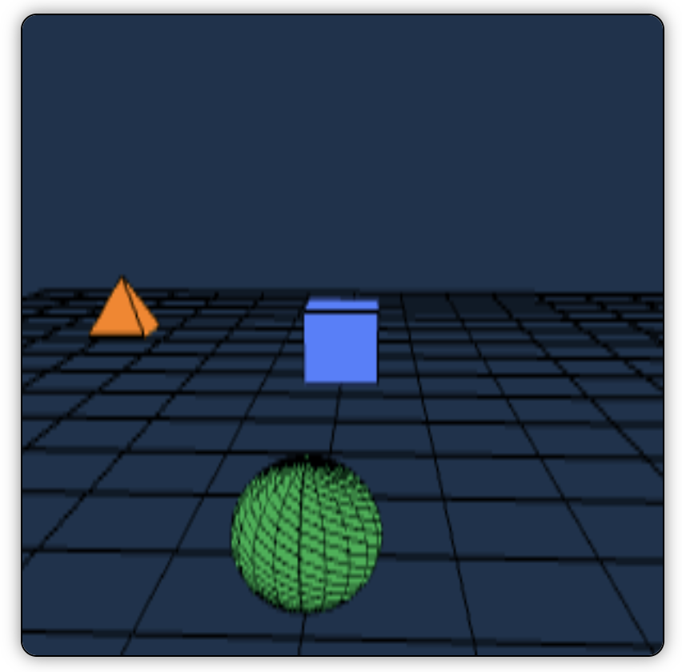

# Informática Gráfica - Práctica 4

**Autor:** Francisco Javier López-Dufour Morales

## Descripción

Este proyecto corresponde a la Práctica 4 de la asignatura de Informática Gráfica. En esta práctica, hemos desarrollado una escena en WebGL que incluye varios objetos con diferentes comportamientos y se han implementado controles para interactuar con ellos.

## Mejoras Implementadas

- **Más objetos en el escenario:** Se han añadido múltiples objetos, como un cubo, una pirámide y una esfera.

- **Objetos con movimiento prefijado:** La pirámide realiza un movimiento circular predefinido alrededor del origen.

- **Esfera que nos persigue:** Se ha implementado una esfera que sigue al jugador con un ligero retraso, manteniéndose siempre visible frente a él.

- **Más controles:** Se han añadido controles adicionales para permitir una mayor interacción, como moverse en todas las direcciones y rotar la vista.

## Controles

- **Movimiento:**
  - <kbd>W</kbd>: Avanzar
  - <kbd>S</kbd>: Retroceder
  - <kbd>A</kbd>: Mover a la izquierda
  - <kbd>D</kbd>: Mover a la derecha
  - <kbd>↑</kbd>: Subir
  - <kbd>↓</kbd>: Bajar

- **Rotación:**
  - <kbd>←</kbd>: Girar a la izquierda
  - <kbd>→</kbd>: Girar a la derecha
  - **Ratón:** Click izquierdo y arrastre para rotar la escena

- **Otros:**
  - <kbd>Espacio</kbd>: Reiniciar posición del jugador
  - <kbd>R</kbd>: Reiniciar ángulo y zoom
  - **Rueda del ratón:** Zoom in/out
  
## Aspectos Técnicos

**Tecnología Utilizada:**

- **WebGL2:** Es una API de gráficos en 3D para navegadores web que permite renderizar gráficos acelerados por hardware sin necesidad de plugins. WebGL2 es la versión más reciente, que incluye mejoras y nuevas características sobre WebGL.

**Uso de Vistas 3D:**

- **Matriz de Vista y Proyección:** Se utilizan matrices de transformación (`modelMatrix`, `viewMatrix`) para posicionar y orientar la cámara y los objetos en el espacio 3D. Esto permite simular una vista en primera persona y navegar por la escena.

**Primitivas Gráficas:**

- **Objetos 3D:** Los objetos como el cubo, la pirámide y la esfera se construyen utilizando primitivas gráficas básicas, principalmente triángulos y líneas.

- **Creación de la Esfera:** La esfera se genera mediante un algoritmo que calcula los vértices y las caras basándose en subdivisiones de latitud y longitud, formando una malla que representa su superficie.

**Visibilidad y Renderizado:**

- **Buffer de Profundidad:** Se habilita el test de profundidad (`gl.enable(gl.DEPTH_TEST)`) para asegurar que los objetos se rendericen correctamente según su distancia a la cámara, gestionando la ocultación entre ellos.

- **Pipeline de Renderizado:** En cada frame, se limpia la pantalla, se actualizan las matrices de transformación y se dibujan los objetos. Esto permite animaciones suaves y actualizaciones en tiempo real.

**Interacción y Movimiento:**

- **Transformaciones:** Se aplican transformaciones de traslación, rotación y escalado a los objetos y a la cámara para lograr movimientos y animaciones.

- **Eventos de Usuario:** Se manejan eventos de teclado y ratón para permitir que el usuario interactúe con la escena, controlando el movimiento del jugador y la vista de la cámara.

## Cómo Ejecutar el Proyecto

1. **Descarga o clona el repositorio** en tu computadora.
2. **Abre el archivo `index.html`** en un navegador web compatible con WebGL2 (como Chrome o Firefox).
3. **Interactúa con la escena** utilizando los controles mencionados anteriormente.

## Dependencias

- **glMatrix:** Biblioteca para operaciones matemáticas con matrices y vectores. Incluida mediante ``.

## Notas Adicionales

- Asegúrate de que tu navegador permita la ejecución de scripts locales o utiliza un servidor local para evitar problemas de seguridad al cargar los archivos.
- Si experimentas algún problema al visualizar la escena, verifica que tu navegador soporte WebGL2 y que esté actualizado a la última versión.

## Capturas de Pantalla

---

¡Disfruta explorando la escena y experimentando con los controles!
